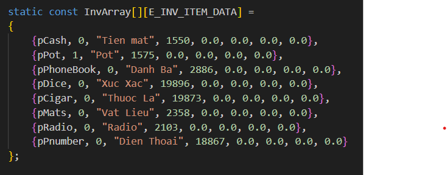
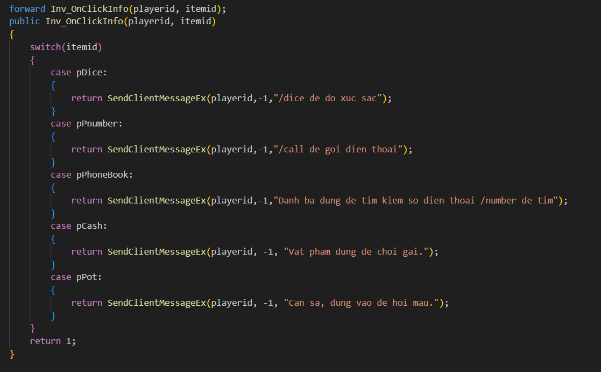
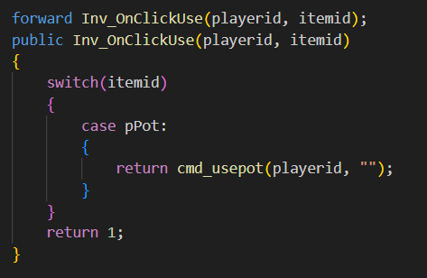

# 🎒 SA-MP InventorySystem (PawnPlus)

Một hệ thống **túi đồ (inventory)** đơn giản, nhẹ, tương thích với mobile, được viết bằng `PawnPlus`. Hỗ trợ các item như `pCash`, `pRadio`,... theo chuẩn gamemode **NGG**, dễ dàng mở rộng thêm vật phẩm mới.

✍️ Tác giả gốc: [Đinh Minh Khôi](https://github.com/dinhkhoi2298)
---
📱 Chuyển thể mobile: [Thuận](https://github.com/quocthuan1007)
---

## 🛠️ Cài đặt

1. 🔗 **Tải PawnPlus** phiên bản mới nhất tại đây:  
   👉 [Release v1.5.1](https://github.com/IS4Code/PawnPlus/releases/tag/v1.5.1)

2. **Thêm vào compile:**

   ```pawn
   #include <pawnplus>
   #include "./includes/system/inventory/inv_ac.pwn"
   #include "./includes/system/inventory/inv.pwn"

3. **Gọi hàm xử lý textdraw:**

// Trong OnPlayerClickTextDraw:
Inv_OnResponse(playerid, clickedid);

// Trong OnPlayerClickPlayerTextDraw:
Inv_OnClick(playerid, playertext);

## 🧾 Cách sử dụng



Hệ thống tương thích với các item có sẵn trong NGG như: pCash, pRadio, pPot,...

Để thêm một vật phẩm mới vào túi đồ, bạn cần thêm vào mảng như sau:

{pCash, 1, "Tien mat", 19313, 0.0, 0.0, 0.0, 0.0},

📌 Giải thích:
pCash là tên thẻ,
1 là có nút sử dụng (0 nếu không cần),
"Tien mat" là tên hiển thị,
19313 là ID object,
các thông số phía sau có thể giữ nguyên nếu không dùng nâng cao.

🖼️ Giao diện
➕ Khi thêm item vào túi đồ


ℹ️ Khi nhấn nút "Thông tin"


🧪 Khi nhấn nút "Sử dụng"

